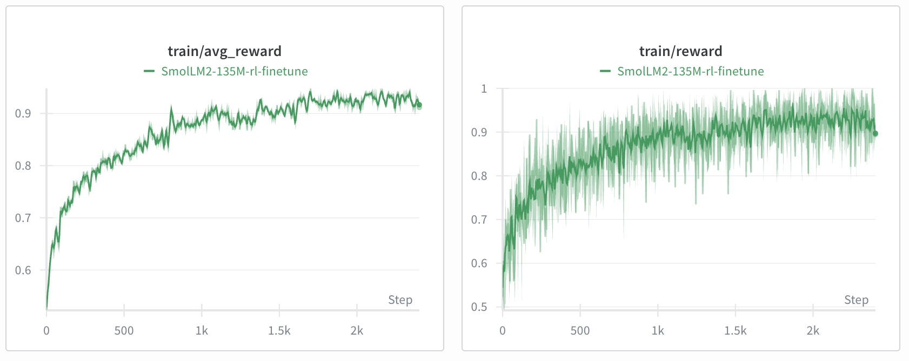

### Lecture 16: Reinforcement learning II: RL for LLMs

This example shows how to fine-tune a language model with reinforcement learning for the task of reversing a string.
- `sft.py`: initial supervised fine-tuning stage
- `reverse_ppo.py`: implementation of PPO-style training with group-based advantages
- `evaluate.py`: utility for evaluating model checkpoints

The `rl_reverse.ipynb` Colab notebook runs the pipeline:
- Colab notebook: 

It is possible to run the training locally. To complete the training quickly  we recommend using Colab. Please see the Colab notebook.

Training takes about 1 hour on a Colab A100 instance, though improvements are already noticeable within 1-2 minutes. Here is the wandb plot from running the notebook to completion (about 1 hour on a Colab A100 instance):

